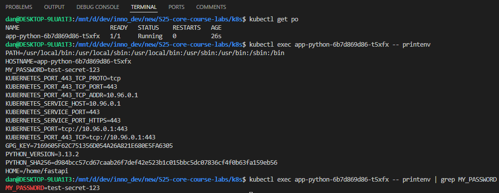

# Kubernetes Secrets and Hashicorp Vault

## Task 1: Kubernetes Secrets and Resource Management

### Using kubectl

Firstly, I have created a Secret using `kubectl`.

```bash
> kubectl create secret generic db-user-pass \
    --from-literal=username=test \
    --from-literal=password='test-secret-123'

secret/db-user-pass created
```

Then, I verified the secret. In the output, we can see the `db-user-pass` secret, and old secrets from the previous lab.

```bash
> kubectl get secrets

NAME                                          TYPE                 DATA   AGE  
db-user-pass                                  Opaque               2      2m13s
sh.helm.release.v1.app-python-1740602511.v1   helm.sh/release.v1   1      2d14h
sh.helm.release.v1.helm-hooks.v1              helm.sh/release.v1   1      2d14h
```

```bash
> kubectl describe secret db-user-pass

Name:         db-user-pass
Namespace:    default     
Labels:       <none>      
Annotations:  <none>      

Type:  Opaque

Data
====
password:  15 bytes       
username:  4 bytes
```

Then, let's decode it.

```bash
> kubectl get secret db-user-pass -o jsonpath='{.data}'

{"password":"dGVzdC1zZWNyZXQtMTIz","username":"dGVzdA=="}
```

We can see that it is decoded in Base64, let's decode the data.

```bash
> echo 'dGVzdA==' | base64 --decode

test

> echo 'dGVzdC1zZWNyZXQtMTIz' | base64 --decode

test-secret-123
```

### Using Helm

I have updated my Helm deployment as instructed in the video. In my case, the name of secret is `MY_PASSWORD`.

At the moment I installed my Helm deployment, the name of pod was `app-python-6b7d869d86-t5xfx`.

Output of `kubectl get po`:

```bash
> kubectl get po

NAME                          READY   STATUS    RESTARTS   AGE        
app-python-6b7d869d86-t5xfx   1/1     Running   0          26s
```

Let's verify the secret inside this pod.

Output:

```bash
> kubectl exec app-python-6b7d869d86-t5xfx -- printenv | grep MY_PASSWORD

MY_PASSWORD=test-secret-123
```


