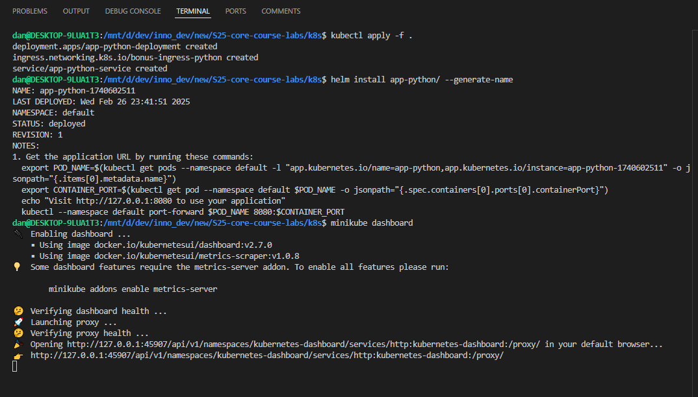
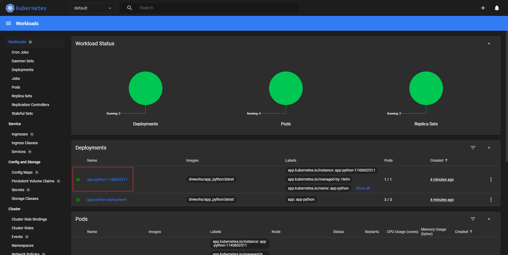
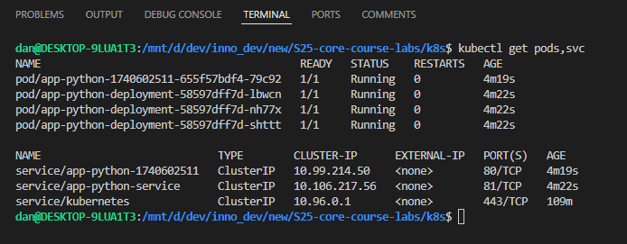
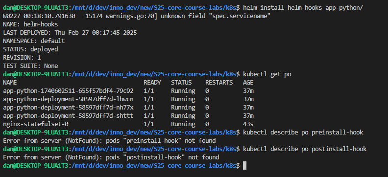

# Introduction to Helm

## Task 1: Helm Setup and Chart Creation

During the Helm setup, I have done the following things:

- generated a Helm chart for my application
- replaced default repository and tag inside `values.yaml`

I did not encounter any issues, so I did not comment out `livenessProbe` and `readinessProbe`.

Here are the screenshots that confirm the healthiness of Helm:








## Task 2: Helm Chart Hooks

I have implemented Helm Chart Hooks (pre-install and post-install).

The output of `kubectl get po`:

```bash
> kubectl get po

NAME                                     READY   STATUS      RESTARTS   AGE
app-python-1740602511-655f57bdf4-79c92   1/1     Running     0          28m
app-python-deployment-58597dff7d-lbwcn   1/1     Running     0          28m
app-python-deployment-58597dff7d-nh77x   1/1     Running     0          28m
app-python-deployment-58597dff7d-shttt   1/1     Running     0          28m
nginx-statefulset-0                      1/1     Running     0          60s
postinstall-hook                         0/1     Completed   0          60s
preinstall-hook                          0/1     Completed   0          97s
```

The output of `kubectl describe po preinstall-hook`:

```bash
> kubectl describe po preinstall-hook

Name:             preinstall-hook
Namespace:        default
Priority:         0
Service Account:  default
Node:             minikube/192.168.49.2
Start Time:       Thu, 27 Feb 2025 00:08:29 +0300
Labels:           <none>
Annotations:      helm.sh/hook: pre-install
Status:           Succeeded
IP:               10.244.0.75
IPs:
  IP:  10.244.0.75
Containers:
  pre-install-container:
    Container ID:  docker://30d15785c1540cf0247f449636843a70010d69af72b49923b8a4f39e068ebb60
    Image:         busybox
    Image ID:      docker-pullable://busybox@sha256:498a000f370d8c37927118ed80afe8adc38d1edcbfc071627d17b25c88efcab0
    Port:          <none>
    Host Port:     <none>
    Command:
      sh
      -c
      echo The pre-install hook is running && sleep 20
    State:          Terminated
      Reason:       Completed
      Exit Code:    0
      Started:      Thu, 27 Feb 2025 00:08:41 +0300
      Finished:     Thu, 27 Feb 2025 00:09:04 +0300
    Ready:          False
    Restart Count:  0
    Environment:    <none>
    Mounts:
      /var/run/secrets/kubernetes.io/serviceaccount from kube-api-access-rm4x6 (ro)
Conditions:
  Type                        Status
  PodReadyToStartContainers   False
  Initialized                 True
  Ready                       False
  ContainersReady             False
  PodScheduled                True
Volumes:
  kube-api-access-rm4x6:
    Type:                    Projected (a volume that contains injected data from multiple sources)
    TokenExpirationSeconds:  3607
    ConfigMapName:           kube-root-ca.crt
    ConfigMapOptional:       <nil>
    DownwardAPI:             true
QoS Class:                   BestEffort
Node-Selectors:              <none>
Tolerations:                 node.kubernetes.io/not-ready:NoExecute op=Exists for 300s
                             node.kubernetes.io/unreachable:NoExecute op=Exists for 300s
Events:
  Type    Reason     Age    From               Message
  ----    ------     ----   ----               -------
  Normal  Scheduled  2m57s  default-scheduler  Successfully assigned default/preinstall-hook to minikube
  Normal  Pulling    2m56s  kubelet            Pulling image "busybox"
  Normal  Pulled     2m45s  kubelet            Successfully pulled image "busybox" in 11.164s (11.164s including waiting). Image size: 4269694 bytes.  Normal  Created    2m45s  kubelet            Created container: pre-install-container
  Normal  Started    2m45s  kubelet            Started container pre-install-container
```

The output of `kubectl describe po postinstall-hook`:

```bash
Name:             postinstall-hook
Namespace:        default
Priority:         0
Service Account:  default
Node:             minikube/192.168.49.2
Start Time:       Thu, 27 Feb 2025 00:09:06 +0300
Labels:           <none>
Annotations:      helm.sh/hook: post-install
Status:           Succeeded
IP:               10.244.0.77
IPs:
  IP:  10.244.0.77
Containers:
  post-install-container:
    Container ID:  docker://5c124829ebc006686221e2f9a4c58c12c0cde365ecaec4fb9f162e54a7d8c30c
    Image:         busybox
    Image ID:      docker-pullable://busybox@sha256:498a000f370d8c37927118ed80afe8adc38d1edcbfc071627d17b25c88efcab0
    Port:          <none>
    Host Port:     <none>
    Command:
      sh
      -c
      echo The post-install hook is running && sleep 15
    State:          Terminated
      Reason:       Completed
      Exit Code:    0
      Started:      Thu, 27 Feb 2025 00:09:32 +0300
      Finished:     Thu, 27 Feb 2025 00:09:47 +0300
    Ready:          False
    Restart Count:  0
    Environment:    <none>
    Mounts:
      /var/run/secrets/kubernetes.io/serviceaccount from kube-api-access-tkxzc (ro)
Conditions:
  Type                        Status
  PodReadyToStartContainers   False
  Initialized                 True
  Ready                       False
  ContainersReady             False
  PodScheduled                True
Volumes:
  kube-api-access-tkxzc:
    Type:                    Projected (a volume that contains injected data from multiple sources)
    TokenExpirationSeconds:  3607
    ConfigMapName:           kube-root-ca.crt
    ConfigMapOptional:       <nil>
    DownwardAPI:             true
QoS Class:                   BestEffort
Node-Selectors:              <none>
Tolerations:                 node.kubernetes.io/not-ready:NoExecute op=Exists for 300s
                             node.kubernetes.io/unreachable:NoExecute op=Exists for 300s
Events:
  Type    Reason     Age    From               Message
  ----    ------     ----   ----               -------
  Normal  Scheduled  3m25s  default-scheduler  Successfully assigned default/postinstall-hook to minikube
  Normal  Pulling    3m25s  kubelet            Pulling image "busybox"
  Normal  Pulled     2m59s  kubelet            Successfully pulled image "busybox" in 2.965s (23.166s including waiting). Image size: 4269694 bytes.
  Normal  Created    2m59s  kubelet            Created container: post-install-container
  Normal  Started    2m59s  kubelet            Started container post-install-container
```

Also, I implemented the Hook Delete Policy, such that it will remove the hook once it has executed successfully (`"helm.sh/hook-delete-policy": "hook-succeeded"`).

Here are the screenshots confirming the correctness of Hook Delete Policy:



### List of requirements

- [x] Helm Chart with Hooks implemented, including the hook delete policy.
- [x] Output of the `kubectl get pods,svc` command in `HELM.md`.
- [x] Output of all commands from the step 4 of Task 2 in `HELM.md`.
