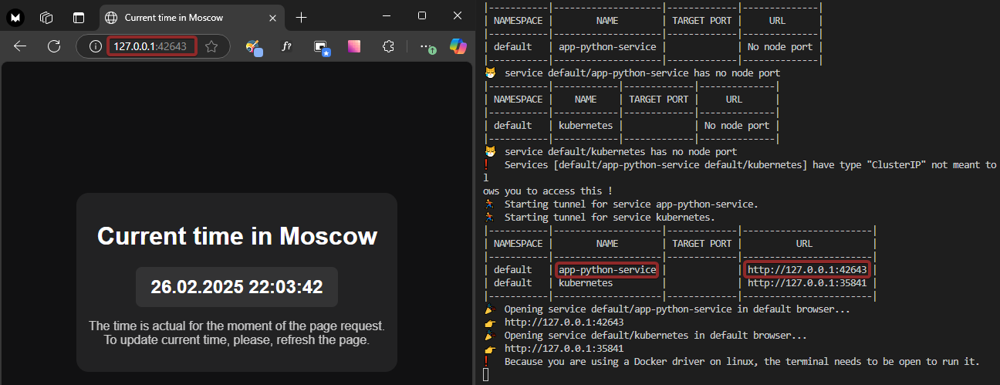

# Introduction to Kubernetes

## Task 1: Kubernetes Setup and Basic Deployment

I have created `Deployment` and `Service` resources for my application.

Output of `kubectl get pods,svc` command:

```bash
> kubectl get pods,svc

NAME                              READY   STATUS    RESTARTS   AGE
pod/app-python-5db479b68b-vqfr8   1/1     Running   0          7m48s

NAME                 TYPE           CLUSTER-IP      EXTERNAL-IP   PORT(S)        AGE
service/app-python   LoadBalancer   10.108.53.201   <pending>     80:30913/TCP   7m42s
service/kubernetes   ClusterIP      10.96.0.1       <none>        443/TCP        8m22s
```


## Task 2: Declarative Kubernetes Manifests

I employed the following configuration files for my application deployment:

- `deployment.yml` manifest file with description of my deployment (with 3 replicas)
- `service.yml` manifest file for my application

All files stored in the `k8s` folder.

Here is the output of `kubectl get pods,svc` command.

```bash
> kubectl get pods,svc

NAME                                         READY   STATUS    RESTARTS   AGE
pod/app-python-deployment-58597dff7d-b42z5   1/1     Running   0          42s
pod/app-python-deployment-58597dff7d-nvw56   1/1     Running   0          42s
pod/app-python-deployment-58597dff7d-pr4n8   1/1     Running   0          42s

NAME                         TYPE        CLUSTER-IP       EXTERNAL-IP   PORT(S)   AGE
service/app-python-service   ClusterIP   10.101.255.109   <none>        81/TCP    42s
service/kubernetes           ClusterIP   10.96.0.1        <none>        443/TCP   3m36s
```

The output of `minikube service --all` command:

```bash
> minikube service --all

|-----------|--------------------|-------------|--------------|
| NAMESPACE |        NAME        | TARGET PORT |     URL      |
|-----------|--------------------|-------------|--------------|
| default   | app-python-service |             | No node port |
|-----------|--------------------|-------------|--------------|
😿  service default/app-python-service has no node port
|-----------|------------|-------------|--------------|
| NAMESPACE |    NAME    | TARGET PORT |     URL      |
|-----------|------------|-------------|--------------|
| default   | kubernetes |             | No node port |
|-----------|------------|-------------|--------------|
😿  service default/kubernetes has no node port
❗  Services [default/app-python-service default/kubernetes] have type "ClusterIP" not meant to be exposed, however for local development minikube all
ows you to access this !
🏃  Starting tunnel for service app-python-service.
🏃  Starting tunnel for service kubernetes.
|-----------|--------------------|-------------|------------------------|
| NAMESPACE |        NAME        | TARGET PORT |          URL           |
|-----------|--------------------|-------------|------------------------|
| default   | app-python-service |             | http://127.0.0.1:42643 |
| default   | kubernetes         |             | http://127.0.0.1:35841 |
|-----------|--------------------|-------------|------------------------|
🎉  Opening service default/app-python-service in default browser...
👉  http://127.0.0.1:42643
🎉  Opening service default/kubernetes in default browser...
👉  http://127.0.0.1:35841
❗  Because you are using a Docker driver on linux, the terminal needs to be open to run it.
```

Here is the screenshot demonstrating that the IP matches the output of `minikube service --all`:

