# Monitoring with Prometheus

## Task 1: Prometheus Setup

### Prometheus Configuration

I have expanded my existing `docker-compose.yml` from the previous lab to include Prometheus.

I configured Prometheus to collect metrics from both Loki and Prometheus containers by using a custom config.

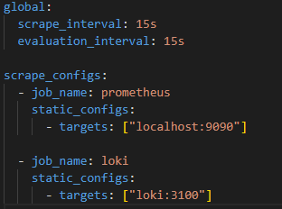

### Verify Prometheus Targets

Here are the screenshots that confirm the successful setup.

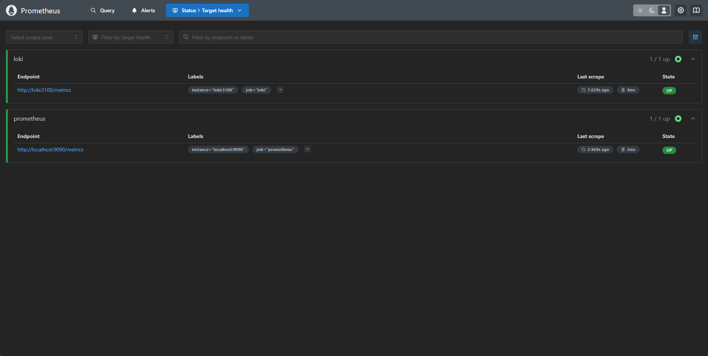

## Task 2: Dashboard and Configuration Enhancements

### Grafana Dashboards

I have downloaded Loki and Prometheus dashboards in JSON format and put them into `/var/lib/grafana/dashboards` directory. \
Also I have specified the `GF_DASHBOARDS_DEFAULT_HOME_DASHBOARD_PATH` variable that allows to open some dashboard by default on home page. I used Loki dashboard as a default one.

I added Prometheus as another datasource for Grafana.

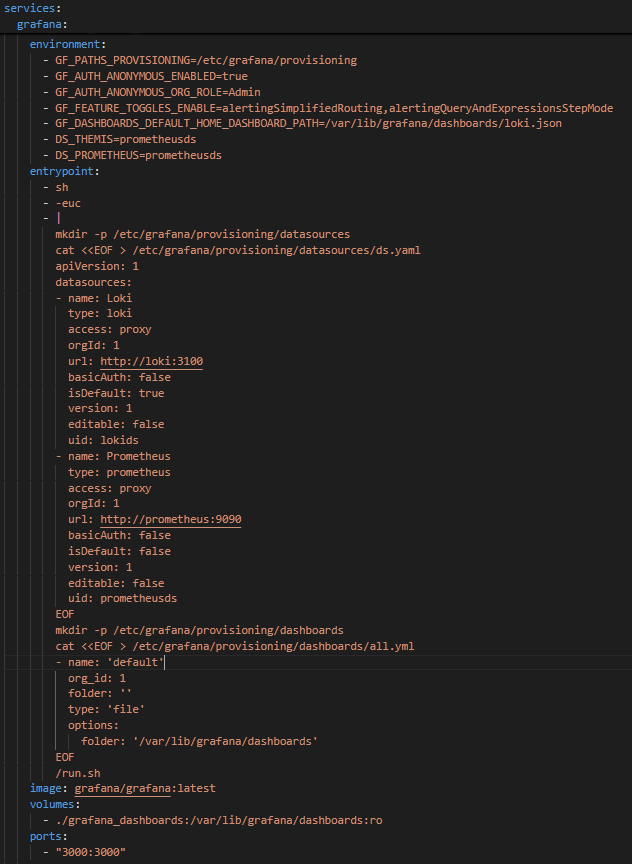

Here are the screenshots displaying successful dashboard configurations.

#### Loki dashboard

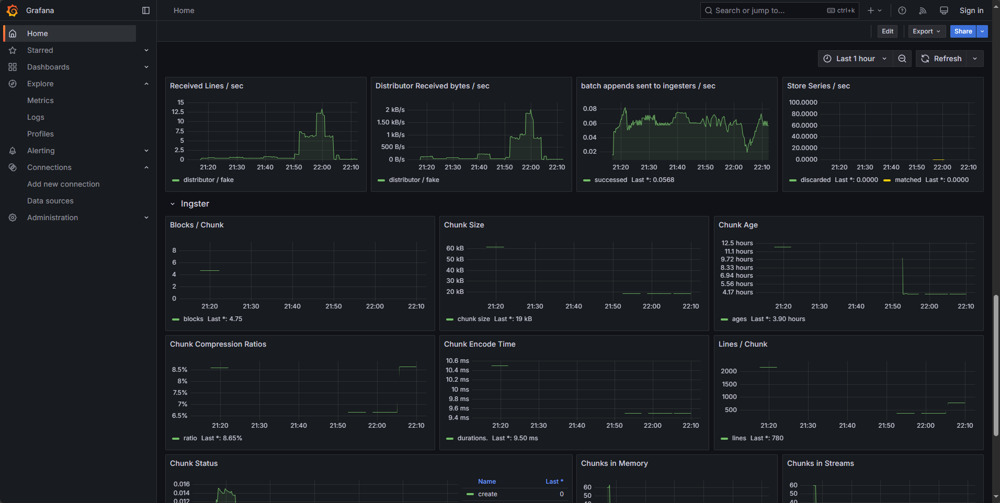

#### Prometheus dashboard

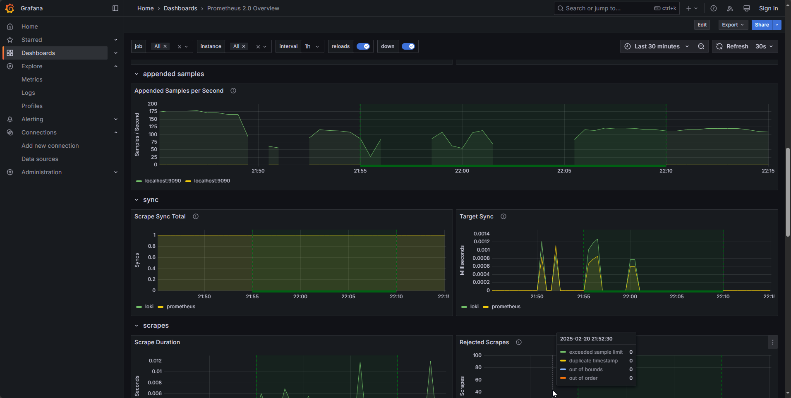

### Service Configuration Updates:

I have added log rotation mechanisms and memory limits for all containers in `docker-compose.yml` (added config to corresponding services).

For log rotation, I have specified the max number of files for rotation (3) and max size for these files (10 Mb). As for memory limits, I specified 256 Mb for my applications services, and 1 Gb for logging stack services.

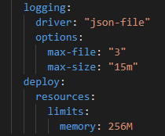
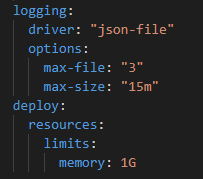

### Metrics Gathering:

I have extended Prometheus configuration to gather metrics from all services defined in `docker-compose.yml`.

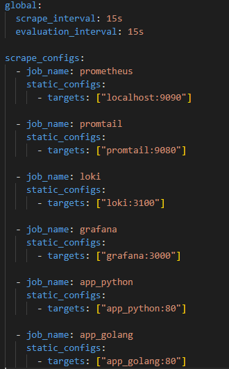

As we can see from the target health status page, the extension of config was successful.

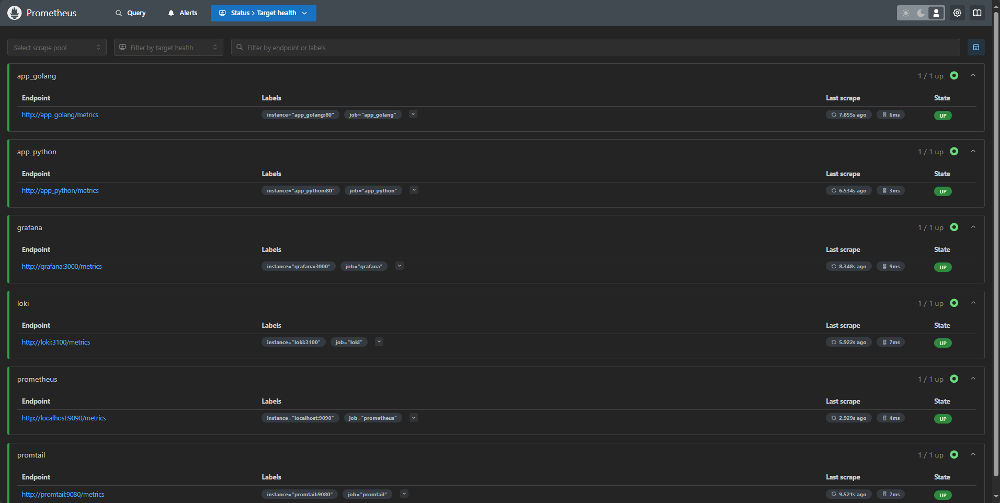

## Bonus Task: Metrics and Health Checks

### Application metrics

#### Python app

I have integrated the following metrics in Python app:

- `time_page_visits` - the number of visits of web page with the current time in Moscow
- `time_json_visits` - the number of visits of API endpoint with the current time in Moscow.

Both metrics are `Counter` metrics because they are not supposed to be less than the previous value (they are supposed just to increase with each new visit).

- `GET /metrics` - introduced a new endpoint that allows to read metrics, mainly for Prometheus

For the setup of these metrics, I used [`prometheus-client`](https://pypi.org/project/prometheus-client/) package.

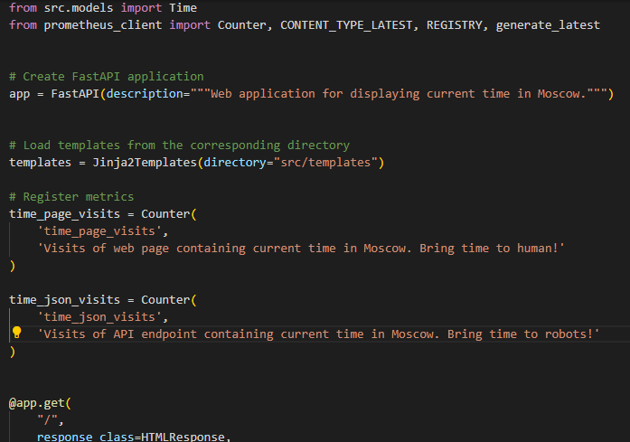
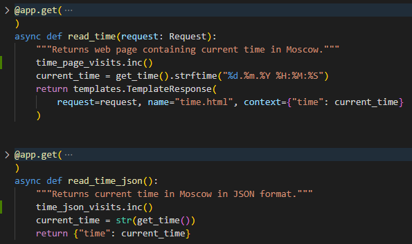
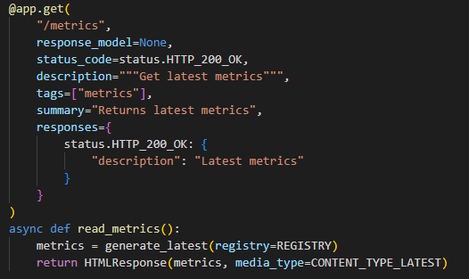

If I try to visit the web page with time or try to make a request to my API endpoint, the metric will increment. We can see this in the Prometheus, if we are querying by `app_python` job.

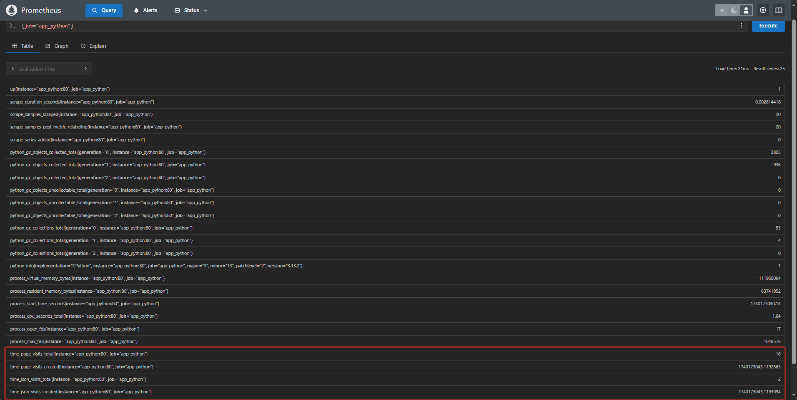

#### Golang app

I have integrated the following metrics in the Golang application:

- `joke_page_visits` - the number of visits of web page with the joke
- `joke_json_visits` - the number of visits of API endpoint with the joke.

Both metrics are still `Counter` metrics because they are not supposed to be less than the previous value (they are supposed just to increase with each new visit).

- `GET /metrics` - introduced a new endpoint that allows to read metrics, again, mainly just for Prometheus

For the setup of these metrics, I used [`prometheus`](https://pkg.go.dev/github.com/prometheus/client_golang@v1.21.0/prometheus) and [`promhttp`](https://pkg.go.dev/github.com/prometheus/client_golang@v1.21.0/prometheus/promhttp) packages.

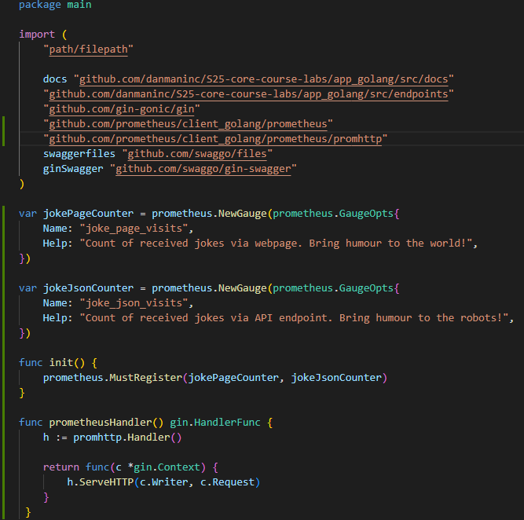
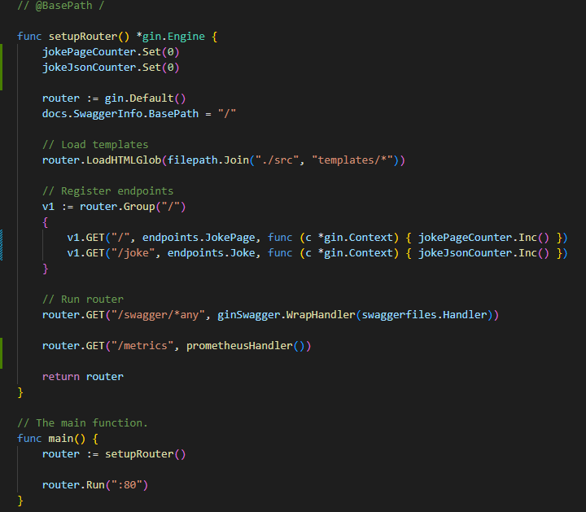

Similarly to the Python app, if I try to visit the web page with joke or try to make a request to my API joke endpoint, the metric will increment.
We can see this in the Prometheus, if we are querying by `app_golang` job.

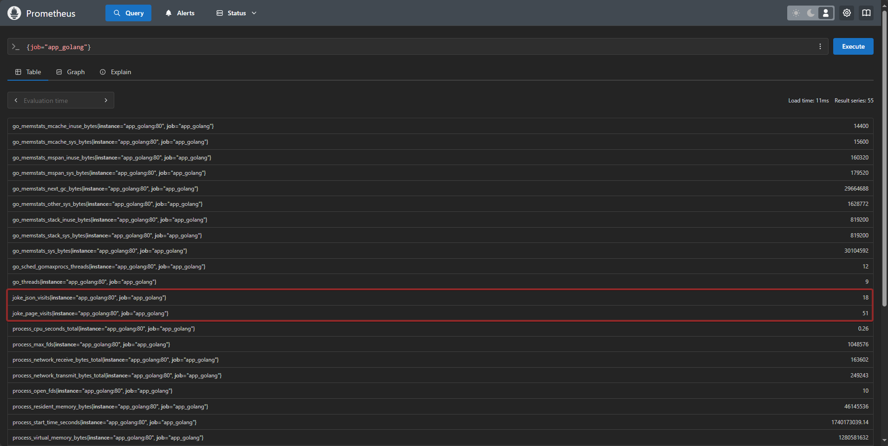
